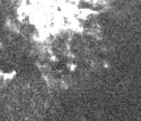
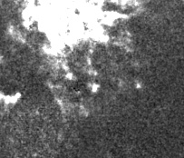
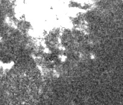
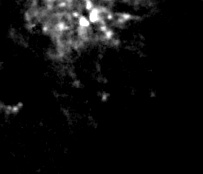
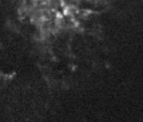

# 標準化の例

解析ソフトでも様々な方法でデータを0-255で標準化してから可視化しているため,どの標準化手法が最も良いか考察する.

 

__結論のみ見るならば一番下までスワイプしてください.全部載ってます.__

 

[標準化とは](https://bellcurve.jp/statistics/course/19647.html)

なお,全ての手法について,fitsデータに含まれる値を0-255の範囲に標準化して,その値の大きさを画像の明るさで表現している.

用いたデータは[NGC4852.fits](https://www.dropbox.com/s/8uy7pnvo2o4s44l/datas.zip?dl=0s)の400or401フレーム目である.

   

## 1.単純な標準化
以下の式を用いて標準化する.

  
 

   
__結果__

   

## 2.自然対数を用いた標準化
以下の式を用いて標準化する.

  
 

 

   
__結果__

   

## 3.正の範囲で自然対数を用いた標準化
なぜか負数も対数表現できてしまい気味が悪かったので,
以下の式を用いて標準化する.

  
 

 

 

   
__結果__

   

## 4.2を底とした自然対数を用いた標準化
真数=0であると計算できないため,以下の式を用いて標準化する.

  
 

 

 

 

   
__結果__

   

## 5.10を底とした自然対数を用いた標準化
真数=0であると計算できないため,以下の式を用いて標準化する.

  
 

 

 

 

   
__結果__

   

## 6.総覧

単純な標準化 → log e n → log e n(1>n,1>n>0) → log 2 n (n>1) → log 10 n(n>1)

    

